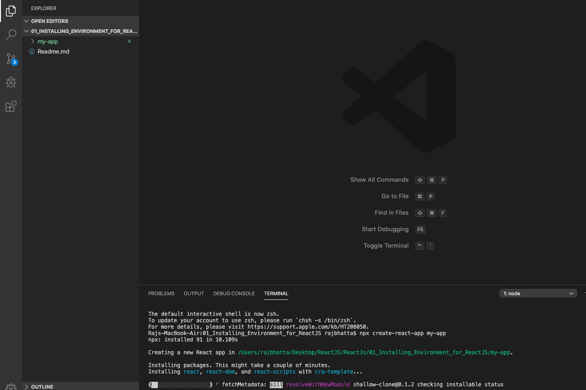

## Installing Required Environment for ReactJS ##

### 1. Install Node from https://nodejs.org/en/download/ ###

### 2. Use node package manager npm to create react project and run react project ###

1. Goto Visual Studio code
2. Goto Terminal inside Visual Studio Code
3. Use create-react-app generator for creating a React App for that goto Visual Studio Code terminal or command prompt to type type
```
npm install -g create-react-app
create-react-app my-app
cd my-app
npm start
```
or 
```
npx create-react-app my-app
cd my-app
npm start
```

### 3. Snapshot of created project in MacOS ###

