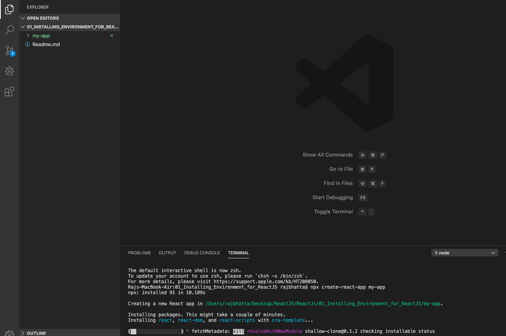
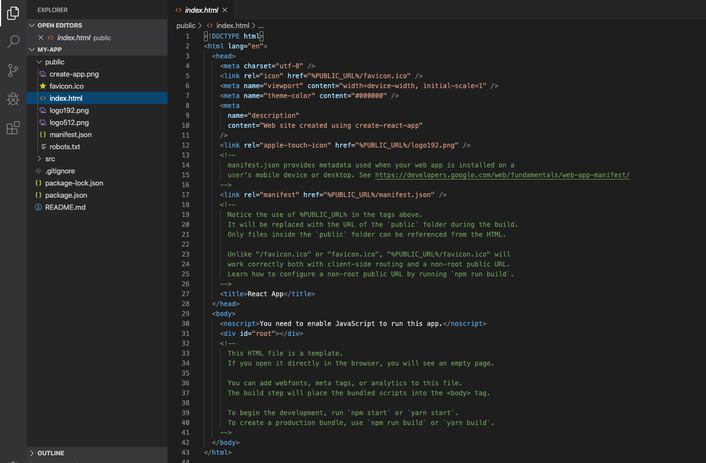
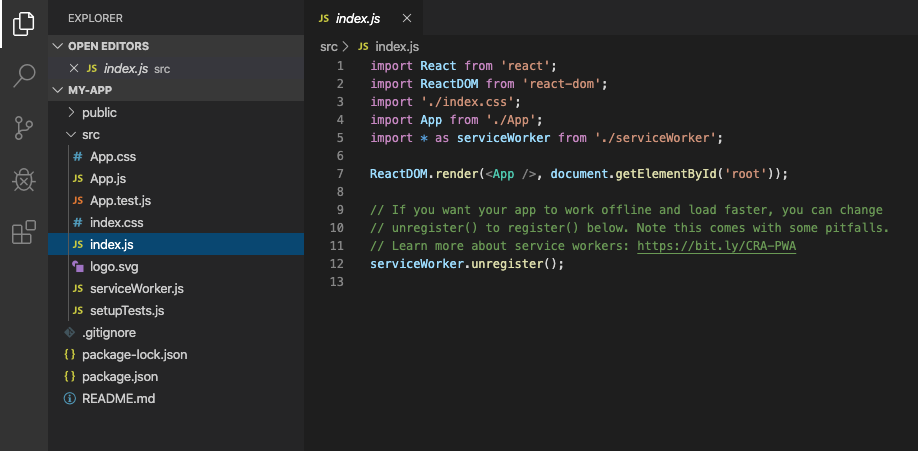
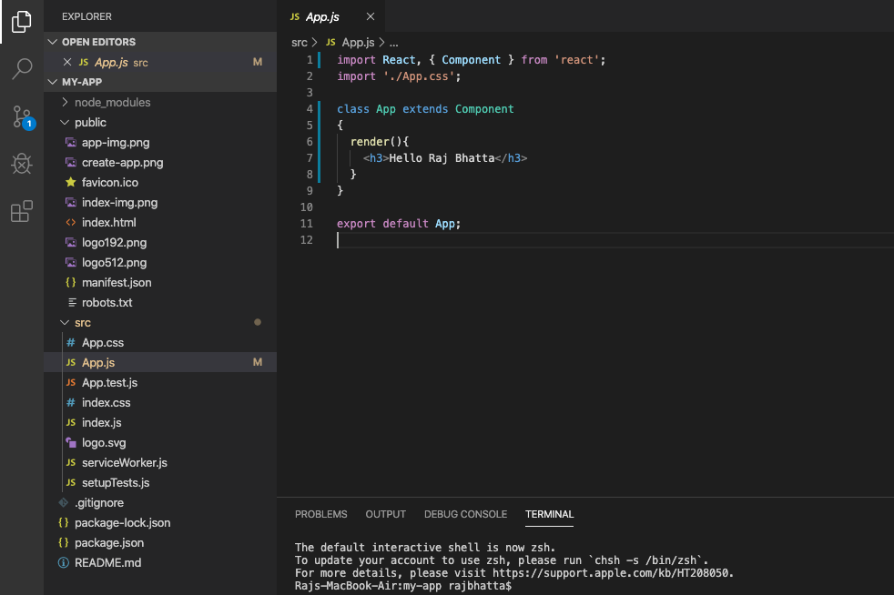

## Installing Required Environment for ReactJS ##

### 1. Install Node from https://nodejs.org/en/download/ ###

### 2. Use node package manager npm to create react project and run react project ###

1. Goto Visual Studio code
2. Goto Terminal inside Visual Studio Code
3. Use create-react-app generator for creating a React App for that goto Visual Studio Code terminal or command prompt to type type
```
npm install -g create-react-app
create-react-app my-app
cd my-app
npm start
```
or 
```
npx create-react-app my-app
cd my-app
npm start
```

### 3. Snapshot of created project in MacOS ###


## 3.1 Folder Directory in ReactJS ##
**1. public folder:** Work with index.html for single page application and it is starting point. Where we have defined 
```
<div id="root"></div> 
```


**2. src:** starting poing 
We specify the root component  that is App component and DOM element which will be controlled by react app. In our case
```
ReactDOM.render(<App />, document.getElementById('root'));
```
which is defined inside index.js


**3. App component represents the view that we see in the browser** 
```
import React, { Component } from 'react';
import './App.css';

class App extends Component
{
  render(){
    <h3>Hello Raj Bhatta</h3>
  }
}

export default App;
```


## Rendering Elements in ReactJS ##
Let’s say there is a <div> somewhere in your HTML file:
 ```
<div id="root"></div>
```
We call this a “root” DOM node because everything inside it will be managed by React DOM.
  
Applications built with just React usually have a single root DOM node. If you are integrating React into an existing app, you may have as many isolated root DOM nodes as you like.

To render a React element into a root DOM node, pass both to **ReactDOM.render():**
```
const element = <h1>Hello, world</h1>;
ReactDOM.render(element, document.getElementById('root'));
```
## what is export default App ##
The export statement is used when creating JavaScript modules to export functions, objects, or primitive values from the module so they can be used by other javascript class or file with the import statement.

export default is used to export a single class, function or primitive from a script file.

The export can also be written as
```
export default class HelloWorld extends React.Component {
  render() {
    return <p>Hello, world!</p>;
  }
}

or

import React, { Component } from 'react';
import './App.css';

class HelloWorld extends Component
{
  render(){
   return(<p>Hello, world</p>);
  }
}

export default App;

```
This is used to import this function in another script file
```
import HelloWorld from './HelloWorld';
```


